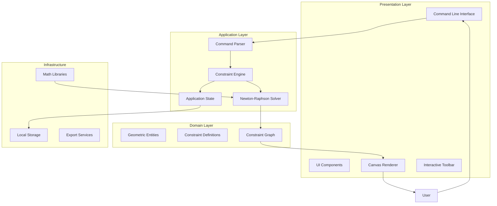
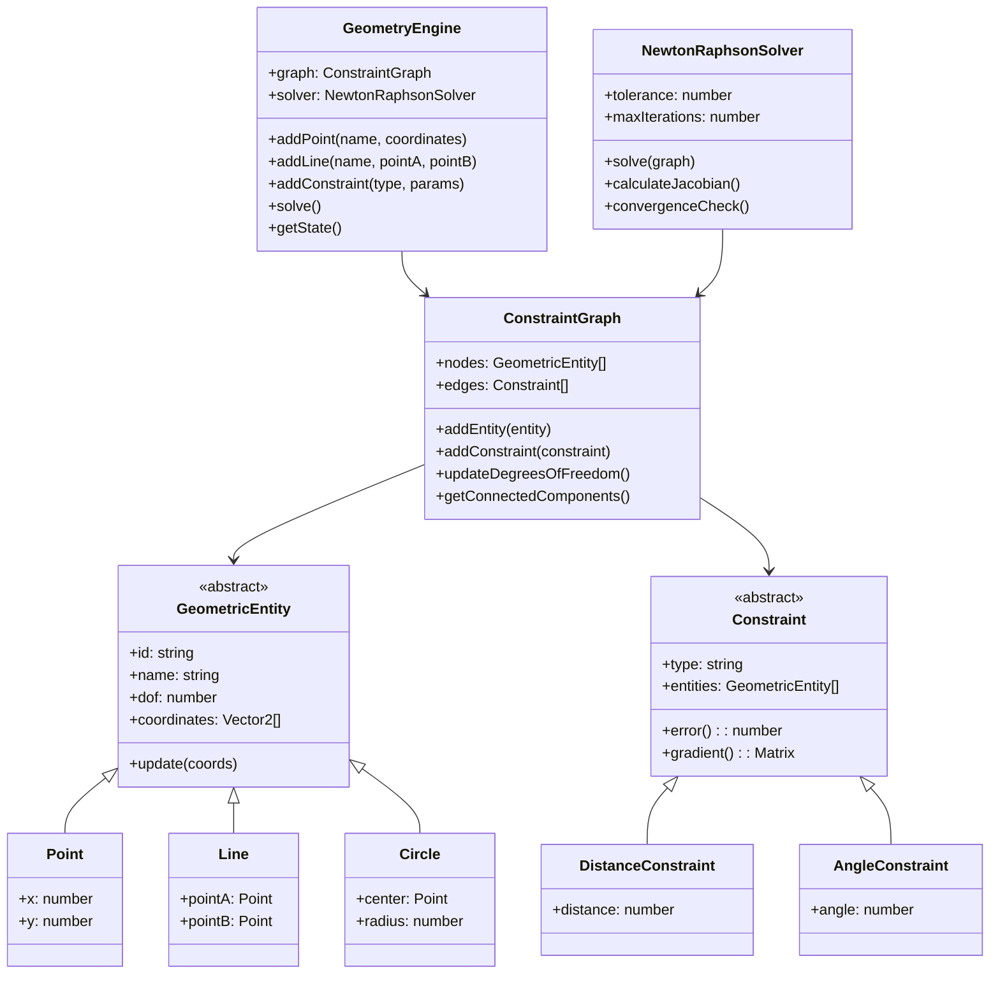
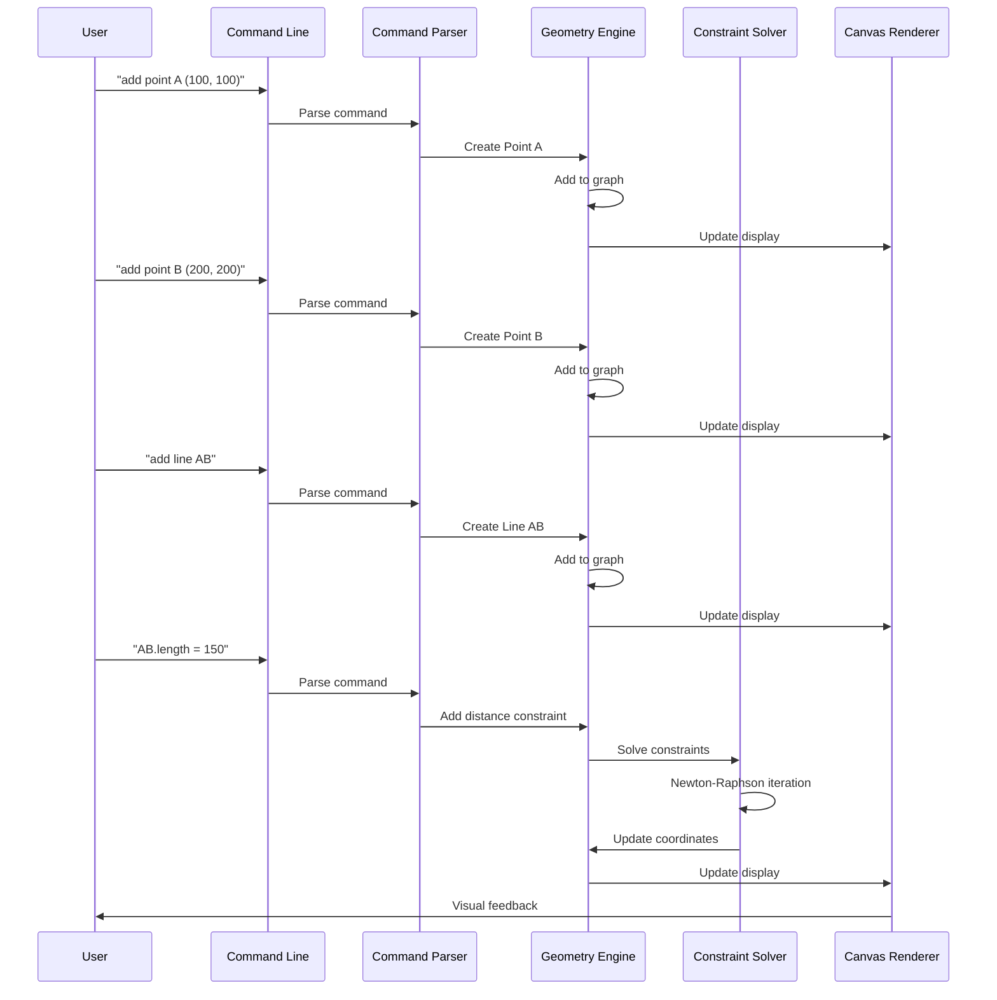
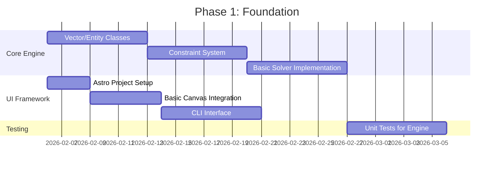
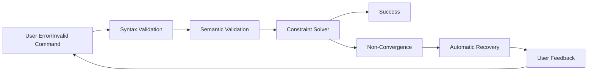

# EUCLIDUS GEOMETRY EXPLORER: System Architecture & Development Plan

## 🎯 **Project Overview**

**Geometry Explorer** is an interactive, browser-based 2D Euclidean geometry teaching tool that combines:
- A constraint-based geometric sketch engine (similar to CAD tools)
- A command-line interface for geometric construction
- Real-time visual feedback and manipulation
- Educational scaffolding for geometry concepts

## 🏗️ **High-Level Architecture**



## 🔧 **Component Architecture**

### **1. Core Engine Components**



### **2. Data Flow Pipeline**



## 🛠️ **Technology Stack**

### **Core Dependencies**
```
├── Frontend Framework
│   ├── Astro (Static Site Generator)
│   └── Vanilla JS (Core Engine)
│
├── Rendering & Graphics
│   ├── PixiJS (Canvas rendering)
│   └── Math.js (Matrix operations)
│
├── Development Tools
│   ├── js 
│   ├── Vite (Build tool via Astro)
│   └── ESLint/Prettier (Code quality)

```

### **Project Structure**
```
geometry-explorer/
├── src/
│   ├── components/
│   │   ├── geometry/
│   │   │   ├── Engine.js          # Main geometry engine
│   │   │   ├── entities/          # Point, Line, Circle classes
│   │   │   ├── constraints/       # Constraint definitions
│   │   │   └── solver/           # Newton-Raphson implementation
│   │   ├── ui/
│   │   │   ├── Canvas.astro       # PixiJS canvas wrapper
│   │   │   ├── CLI.astro         # Command line interface
│   │   │   ├── Toolbar.astro     # Interactive controls
│   │   │   └── Grid.astro        # Grid rendering
│   │   └── utils/
│   │       ├── parser.js         # Command parser
│   │       ├── storage.js        # Local storage helpers
│   │       └── export.js         # SVG/PNG export
│   ├── pages/
│   │   └── index.astro           # Main application page
│   └── styles/
│       └── global.css            # Global styles
├── public/
│   ├── examples/                 # Sample geometry files
│   └── docs/                     # User documentation
└── tests/
    ├── unit/                     # Unit tests for engine
    └── integration/              # End-to-end tests
```

## 📋 **Development Phases**

### **Phase 1: Foundation (Weeks 1-4)**


### **Phase 2: Core Features (Weeks 5-8)**
1. **Constraint Types Implementation**
   - Distance constraints
   - Angle constraints  
   - Parallel/perpendicular
   - Coincident constraints

2. **Interactive Features**
   - Point dragging with constraint solving
   - Real-time visual feedback
   - Grid snapping

3. **Enhanced Parser**
   - Natural language commands
   - Error handling and suggestions
   - Command history

### **Phase 3: Polish & Education (Weeks 9-12)**
1. **Educational Features**
   - Step-by-step tutorials
   - Constraint visualization
   - Degrees of freedom display
   - Error highlighting

2. **Export & Sharing**
   - SVG export
   - PNG screenshots
   - Shareable links
   - Project saving/loading

3. **Performance Optimization**
   - Sparse matrix solver
   - Render optimizations
   - Memory management

## 🔐 **Key Technical Decisions**

### **1. Constraint Solving Approach**
- **Primary Solver**: Newton-Raphson with damped iterations
- **Fallback**: Gradient descent for tricky configurations
- **Validation**: Degrees of freedom analysis before solving

### **2. Rendering Strategy**
- **Primary**: PixiJS with WebGL acceleration
- **Fallback**: Canvas 2D API
- **Grid**: Custom shader-based grid with snapping

### **3. State Management**
```javascript
// Application state structure
const state = {
  entities: {
    'point_A': { type: 'point', x: 100, y: 100, fixed: false },
    'line_AB': { type: 'line', start: 'point_A', end: 'point_B' }
  },
  constraints: [
    { type: 'distance', entities: ['point_A', 'point_B'], value: 100 }
  ],
  view: {
    zoom: 1.0,
    pan: { x: 0, y: 0 },
    gridVisible: true,
    snapEnabled: true
  },
  history: [] // For undo/redo
};
```

### **4. Error Handling Strategy**


## 🧪 **Testing Strategy**

### **Unit Tests**
- Geometric entity creation and manipulation
- Constraint satisfaction calculations
- Parser command recognition
- Solver convergence tests

### **Integration Tests**
- End-to-end construction workflows
- Constraint solving with multiple entities
- UI interaction flows
- Export functionality

### **Performance Tests**
- Solver performance with 100+ entities
- Render frame rate under stress
- Memory usage profiling

## 🚀 **Deployment Strategy**

### **Development**
- Local development server (`npm run dev`)
- Hot reload for rapid iteration
- Development-only debugging tools

### **Production**
- Static site generation via Astro
- CDN hosting (Netlify/Vercel)
- Progressive Web App capabilities
- Offline functionality for saved projects

## 📈 **Success Metrics**

### **Technical Metrics**
- Solver convergence time: < 100ms for 50 entities
- Frame rate: 60fps during interaction
- Initial load time: < 3 seconds
- Bundle size: < 500KB compressed

### **User Experience Metrics**
- Time to first successful construction: < 2 minutes
- Error recovery success rate: > 90%
- User retention after tutorial: > 70%
- Educational effectiveness (TBD via user studies)

## 🔄 **Maintenance & Evolution**

### **Short-term (3 months)**
- Bug fixes and performance optimizations
- Additional constraint types
- Mobile responsiveness improvements

### **Medium-term (6 months)**
- 3D geometry extension
- Plugin system for custom constraints
- Collaborative editing features
- Integration with geometry textbooks

### **Long-term (12 months)**
- AI-assisted geometry proof generation
- Integration with CAD software
- Classroom management features
- Multi-language support

---

**This document serves as the architectural reference for the GEOMETRY EXPLORER project. All development decisions should align with this architecture unless explicitly approved through architectural review.**